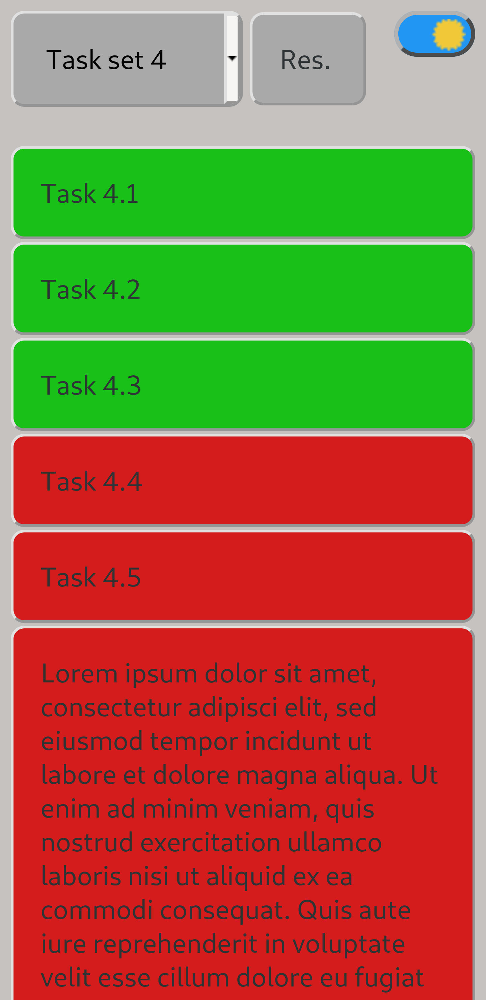

# checklist  
Simple checklist web-app for mobile devices with lightning fast UI.  
  
## Table of contents  
* [General info](#general-info)  
* [Technologies](#technologies)  
* [Setup](#setup)  
  
## General info  
Main idea is that you have preconfigured list of different checklists.  
You choose from the dropdown menu the correct checklist and then get a list of tasks you have to accomplish.
By clicking individual task, its color change and gives you a visual signal that you have completed that task.
 

  

	
## Technologies  
Project is created with: 
* VanillaJS
* CSS
	
## Setup  
Checklist items are written in tasks.xml and are downloaded asynchronously after page is visible.  
Build directory holds current minified .js and .css files.  
Public directory contains other assets.  
