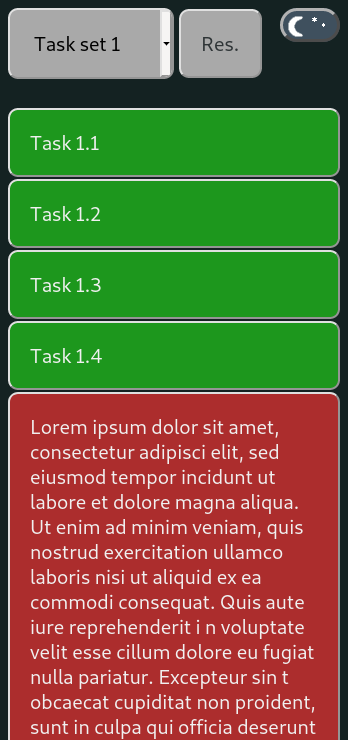

# checklist  
Simple checklist web app for mobile devices with lightning fast UI.  
  
## Table of contents  
* [General info](#general-info)  
* [Technologies](#technologies)  
* [Setup](#setup)  
  
## General info  
The main idea is that you have a preconfigured list of different checklists.  
You can choose from the dropdown menu the correct checklist and then get a list of tasks you have to accomplish.
By clicking an individual task, its color change and then gives you a visual sign that you have completed that task.
  

  

	
## Technologies  
Project is created with: 
* VanillaJS
* CSS
	
## Setup  
Checklist items are written in tasks.xml and are downloaded asynchronously after page is visible.  
Src directory holds project .js and .css files.  
Don't forget to minify those files before you deploy. As a cheffs recomendation I would prefer [this](https://github.com/Brebl/minifier) minifier.  
Public directory contains other assets.  
